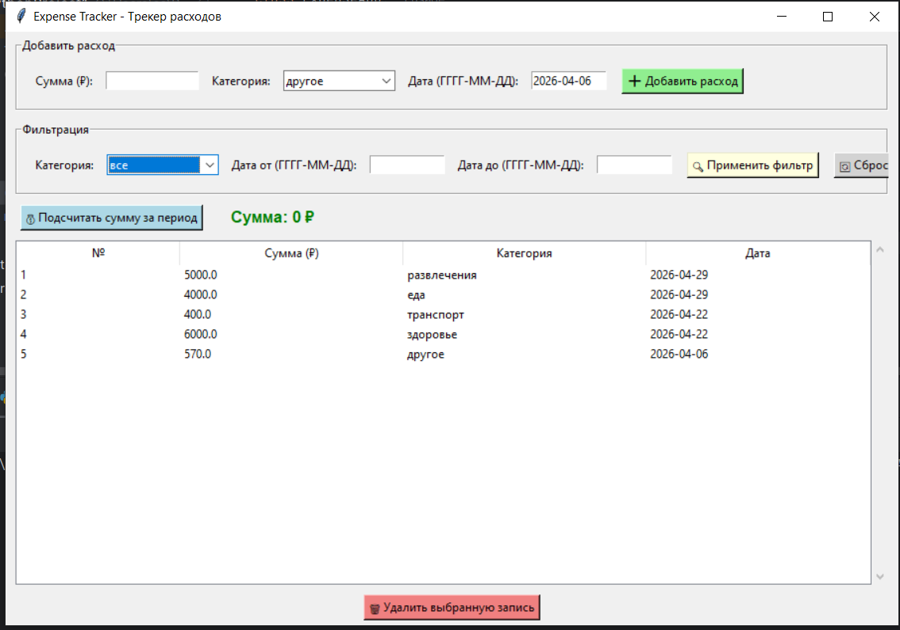
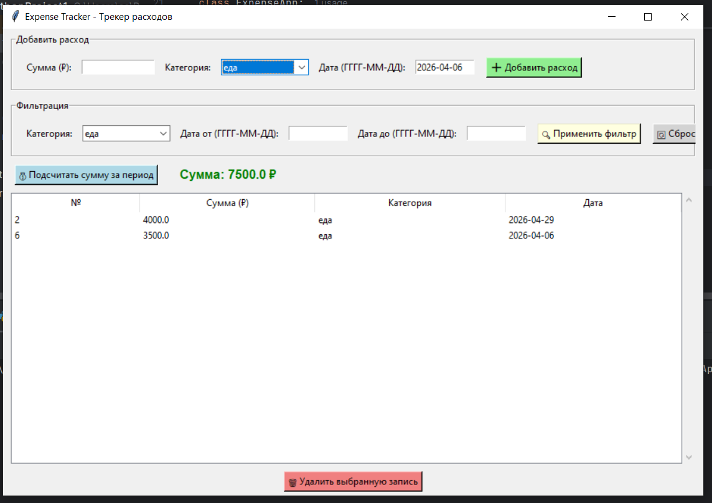
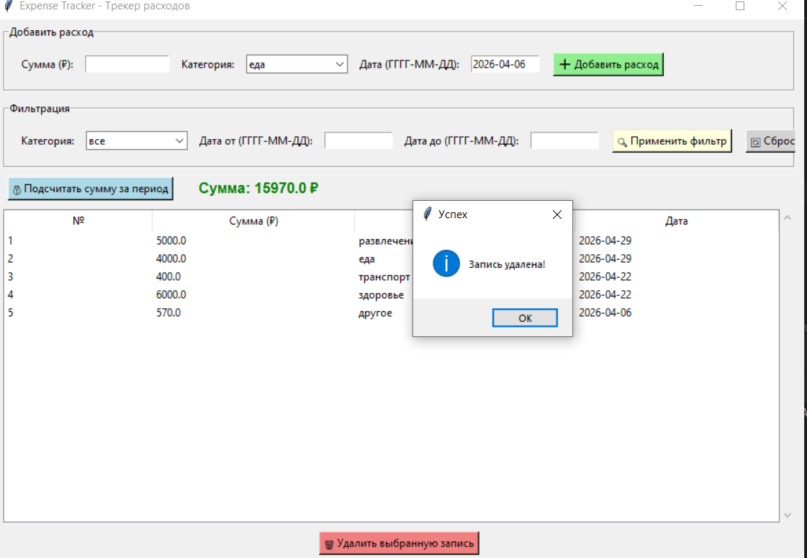

# Expense Tracker (Трекер расходов)

**Автор:** Ахметова Елизавета Маратовна  
**Вариант:** Expense Tracker  
**Дата сдачи:** 30.04.2026

## Описание программы

Приложение для отслеживания личных расходов. Позволяет добавлять расходы с указанием суммы, категории и даты, фильтровать по категории и периоду, подсчитывать общую сумму расходов за выбранный период. Все данные сохраняются в JSON-файл.

## Требования для запуска

- Python 3.10 или выше
- Tkinter (входит в стандартную поставку Python)

## Как запустить

```bash
git clone https://github.com/lizaww/expense-tracker.git
cd expense-tracker
python main.py
```

## Как пользоваться

1. **Добавление расхода:** введите сумму, выберите категорию, укажите дату → нажмите «Добавить расход»
2. **Фильтрация:** выберите категорию или укажите период (дата от/до) → нажмите «Применить фильтр»
3. **Подсчёт суммы:** нажмите «Подсчитать сумму за период» — покажет общую сумму отфильтрованных расходов
4. **Удаление:** выберите запись в таблице → нажмите «Удалить выбранную запись»

## Пример работы

### Добавление расхода:
Вводим сумму «500», категория «еда», дата «2026-04-30» → нажимаем «Добавить расход» → запись появляется в таблице.

### Фильтрация по категории:
Выбираем категорию «транспорт» → нажимаем «Применить фильтр» → показываются только расходы на транспорт.

### Подсчёт суммы за период:
Указываем даты «2026-04-01» до «2026-04-30» → нажимаем «Подсчитать сумму за период» → показывает общую сумму.

## Тестирование

| Тип теста | Пример | Результат |
|-----------|--------|------------|
| Позитивный | Сумма 500, категория еда, дата 2026-04-30 | ✅ Добавлено |
| Негативный | Сумма -100 | ❌ Ошибка: сумма должна быть положительной |
| Негативный | Сумма «abc» | ❌ Ошибка: введите число |
| Негативный | Дата «30.04.2026» | ❌ Ошибка: неверный формат |
| Граничный | Сумма 0.01 | ✅ Добавлено |

## Пример работы (скриншоты)





## Ссылка на GitHub

[https://github.com/lizaww/expense-tracker](https://github.com/lizaww/expense-tracker)
```
nse-tracker.git
cd expense-tracker
python main.py
